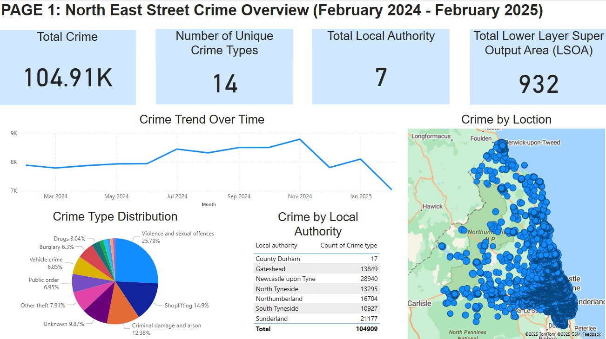
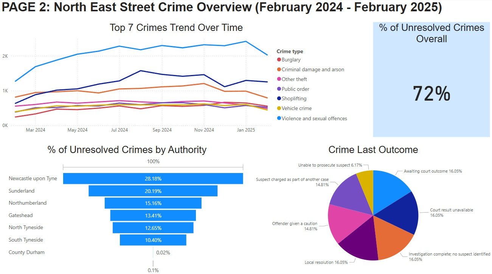
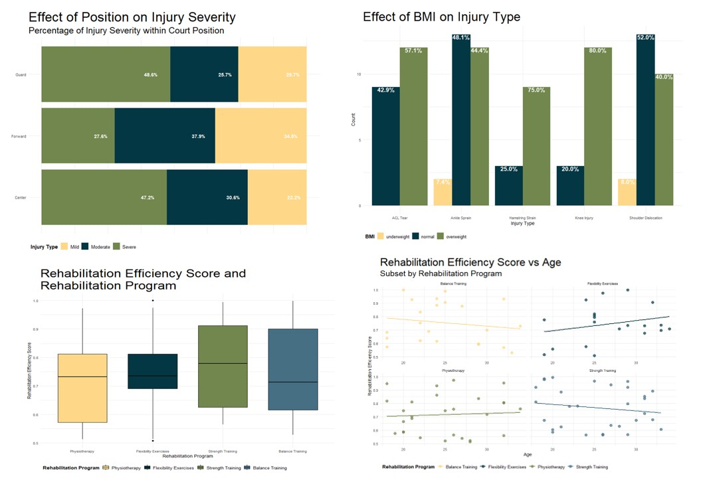
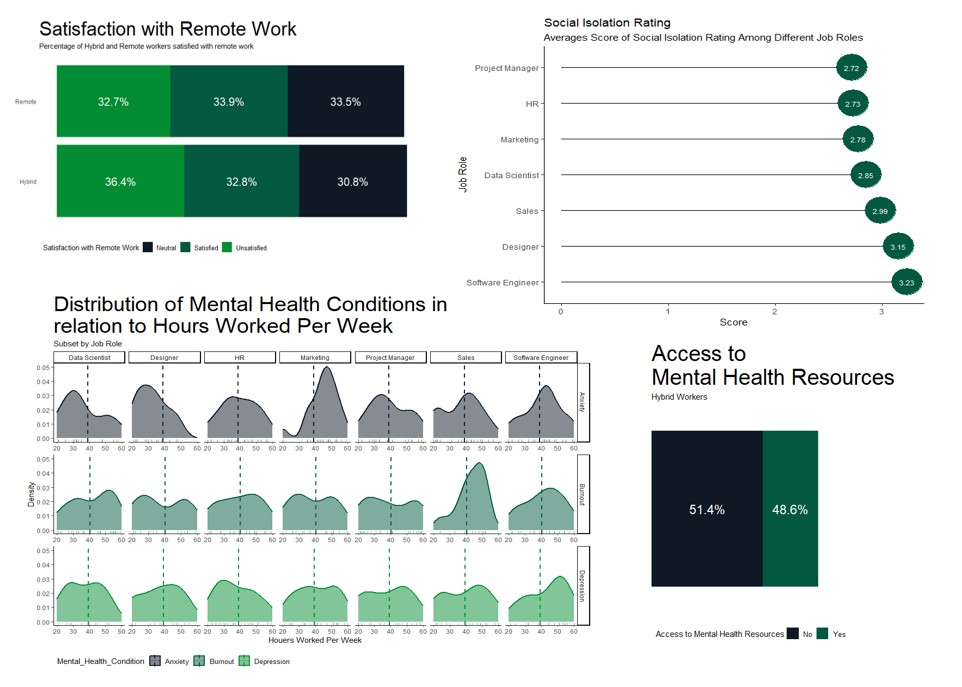

<!--Section 1: Introduce your self-->
## ABOUT ME
I'm a data analyst entering the analytics world with a unique perspective.
My background in Sport Science gave me a strong foundation in human behavior and evidence-based practice, while my Master’s in Business Analytics has developed my skills in data, research, and evaluation.
I’m passionate about using these to uncover insights, improve decision-making, and explore complex problems with data.

<!--Mention your top/relevant skills here - core and soft skills-->
## WHAT I DO
*As an emerging data analyst, I apply data-driven approaches to uncover insights and solve problems.*

**- ✅ Data Analysis & Visualization.**  
I analyze and visualize data using Excel, SPSS, R Studio, SQL, and Power BI to create clear and actionable insights.

**- ✅ Research & Evaluation.**  
I design and conduct research studies, applying statistical methods and evidence-based practices to answer key questions.

**- ✅ Communication & Collaboration.**  
I present findings through reports and presentations and work well in teams to deliver data-driven projects.

## MY PORTFOLIO

*A glimpse of some of the projects I've been working on.*

---

**Crime Detection in Northumbria**
layout: default
title: Crime Detection in Northumbria
---

# 🕵️‍♂️ Crime Detection in Northumbria

A data-driven investigation into street-level crime patterns across Northumbria, using statistical analysis and geospatial methods to support smarter policing decisions.

---

## 📊 Interactive Dashboards

This project includes two interactive Power BI dashboards that provide insights into regional crime distribution and unresolved case trends.

- **Dashboard 1**: Crime overview by type and local authority (heatmaps, pie charts, distribution tables)
- **Dashboard 2**: Trends over time, seasonal spikes, and resolution outcomes

📥 [Download Power BI File](Crime%20dashboard%201%20and%202.pbip)

---

## 🔍 Project Summary

- **Location**: Northumbria Police jurisdiction (7 local authorities, 932 LSOAs)
- **Period Analysed**: February 2024 – February 2025  
- **Total Records**: 104,909 reported crimes  
- **Unsolved Cases**: 72% of street-level crimes  
- **Most Common Crime**: Violence & Sexual Offences (25.79%)  
- **Top Hotspot**: Newcastle upon Tyne (28,940 crimes, 28.18% unsolved)

---

## 🧪 Methodology

The project uses a combination of descriptive and diagnostic techniques:

| Technique         | Tool/Method Used                     | Purpose                                              |
|------------------|--------------------------------------|------------------------------------------------------|
| Descriptive       | Power BI                             | Visualize crime patterns and monthly trends          |
| Statistical Test  | Chi-Square Test in R                 | Check dependence of crime type on location           |
| Geospatial        | Getis-Ord Gi\* Statistic (R)         | Detect crime hotspots and cold spots using GPS data  |

Data sources:
- 📂 [Police Data API](https://data.police.uk/data/)
- 📂 [LSOA Northeast Dataset (UK Gov)](https://assets.publishing.service.gov.uk/media/60423ba6e90e077dd43107f4/LSOA_-_A_-_North_East_1819.ods)

---

## 📌 Key Insights

- **Newcastle** is a consistent hotspot, with high frequency and high % of unsolved cases.
- **Shoplifting** is unusually high in South Tyneside; **vehicle crime** spikes in Sunderland.
- **Getis-Ord Gi\*** results revealed crime concentration hotspots not visible through basic charts.
- Seasonal peaks were observed in **November**, suggesting possible links with environmental or social factors.

---

## 💾 Repository Contents

| Folder/File                        | Description                             |
|----------------------------------|---------------------------------------|
| [`README.md`](README.md)                      | Project documentation and setup       |
| [`Crime dashboard 1 and 2.pbip`](Crime%20dashboard%201%20and%202.pbip)  | Power BI dashboards (interactive)     |
| [`Chisquared test.R`](Chisquared%20test.R)              | Chi-square statistical test           |
| [`GetisOrd GiStatistic.R`](GetisOrd%20GiStatistic.R)         | Getis-Ord Gi* spatial test             |
| [`DATA PREPARATION.R`](DATA%20PREPARATION.R)             | Data preparation (includes script to obtain final dataset) |
| [`hot cold spot map.png`](hot%20cold%20spot%20map.png), [`hot cold spot table.png`](hot%20cold%20spot%20table.png) | Visual previews and heatmaps        |

> **Note:** The final cleaned dataset is not included due to its large size. Please run the `DATA PREPARATION.R` script to generate it.

---

## ⚖️ Limitations & Considerations

- Data covers **only 1 year**, limiting long-term pattern recognition.
- Some entries contain **missing or unknown values**, which may bias results.
- Results are **specific to Northumbria** and may not generalize to other regions.

---
## 🔮 Potential Enhancements

To enrich the insights and improve the predictive accuracy of this crime analysis project, the following external datasets and enhancements are recommended:

- 🔗 **ONS Demographic & Income Data**  
  Add population density, income levels, and deprivation indices to correlate socioeconomic factors with crime patterns.

- 🧠 **NHS Health Data**  
  Include datasets on mental health admissions and substance misuse to investigate possible links with specific crime types or areas.

- 🏙️ **Urban Infrastructure Data**  
  Overlay data on street lighting, CCTV coverage, and public transport to explore how urban infrastructure impacts crime rates and detection.

- 📚 **Education & Youth Statistics**  
  Integrate school location and attendance data to analyze the relationship between education access and youth-involved crime trends.

- 🌦️ **Weather & Seasonal Data**  
  Add local meteorological data to assess the influence of weather and seasons on crime occurrence and type distribution.

---

**Basketball Players Injury**

*Description here...*

[Read More](#)

---

**The Effect of Remote Work on Mental Wellbeing**

*Description here...*

[Read More](#)

---

**Predictive Modeling and Fairness Analysis of Tech Industry Salaries**

*Description here...*

[Read More](#)

